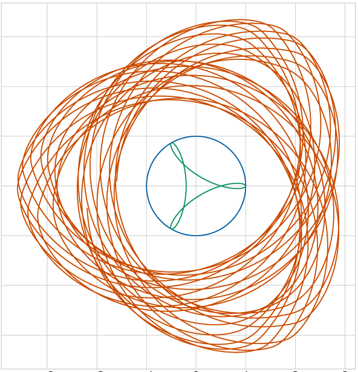

# trochoid.py

Python script to draw a [trochoid](https://en.wikipedia.org/wiki/Trochoid)



A trochoid is the curve described by a fixed point on a circle rolling along a fixed path.
A trochoid family is categorized with a relationship between the radius of a drawing circle ($r_d$) and the radius of a rolling (moving) circle ($r_m$), location of the rolling circle (inside/outside) and the shape of a fixed path.

## Trochoid Family

| Name                                                       | Radius         | Inside/Outside | Fixed Path    |
| ---------------------------------------------------------- | -------------- | -------------- | ------------- |
| [Cycloid](https://en.wikipedia.org/wiki/Cycloid)           | $r_d = r_m$    | -              | Straight line |
| [Hypotrochoid](https://en.wikipedia.org/wiki/Hypotrochoid) | $r_d \neq r_m$ | In             | Circle        |
| [Epitrochoid](https://en.wikipedia.org/wiki/Epitrochoid)   | $r_d \neq r_m$ | Out            | Circle        |
| [Hypocycloid](https://en.wikipedia.org/wiki/Hypocycloid)   | $r_d = r_m$    | In             | Circle        |
| [Epicycloid](https://en.wikipedia.org/wiki/Epicycloid)     | $r_d = r_m$    | Out            | Circle        |

## How to use

```bash
poetry run python3 scripts/draw.py
```

```bash
 % poetry run python3 scripts/draw.py -h
usage: draw.py [-h] [--figsize FIGSIZE FIGSIZE] [-o OUTPUT] [--shape SHAPE] [--rc RC] [--rm RM] [--rd RD] [-n NUM]

options:
  -h, --help            show this help message and exit

figure:
  --figsize FIGSIZE FIGSIZE
                        figure size w x h
  -o OUTPUT, --output OUTPUT

shape:
  --shape SHAPE         hypocycloid or epicycloid
  --rc RC               constant circle radius
  --rm RM               moving circle radius
  --rd RD               drawing arm length
  -n NUM, --num NUM     num of points
```

## Calculation for Drawing Point

| Name     | Definition                    |
| -------- | ----------------------------- |
| $s$      | Length of path of rolling     |
| $r_d$    | Radius of drawing circle      |
| $r_m$    | Radius of rolling circle      |
| $p_m$    | Position of rolling circle    |
| $p_d$    | Position of drawing point     |
| $\theta$ | orientation of rolling circle |
| $p(s)$   | Fixed path                    |

The length of path of rolling ($s$) is summation of $\Delta s$ :

\begin{align}
\Delta s &= \sqrt{dx[i]^2 + dy[i]^2} \\\
s &= \sum_0^n \Delta s
\end{align}

The moving circle rolls along the fixed path without slippage.

$$
\begin{align}
r_m\theta &= s
\end{align}
$$

This equation is transformed for the orientation of a rolling circle.

$$
\begin{align}
\theta & = s/r_m \\\
\Delta \theta &= \Delta s/r_m ,
\end{align}
$$

A tangential vector ($t[i]$) and a normal vector ($n[i]$) at $p[i]$ are

$$
\begin{align}
t[i] &= \frac{p[i+1]-p[i-1]}{2} \\\
n[i] &= \frac{t[i+1]-t[i-1]}{2} \\\
&= \frac{p[i+2]-p[i-2]}{4}
\end{align}
$$

The position of a rolling circle ($p_m[i]$) is described with a unit normal vector ($n_u[i]$):

$$
\begin{align}
p_m[i] &= p[i] + r_m n_u[i]
\end{align}
$$

This $n_u$ depends on concavity and convexity of the fixed line.
$n_u$ is redefined with a following equation,

$$
\begin{align}
n_u[i] &= R（\frac{\pi}{2}） t_u[i]
\end{align}
$$

where $R$ is a rotation matrix.

Finally, $p_d[i]$ is described a following equation.

$$
\begin{align}
p_d[i] &= p_m[i] + r_d R(\theta[i]) p_d[0]
\end{align}
$$
